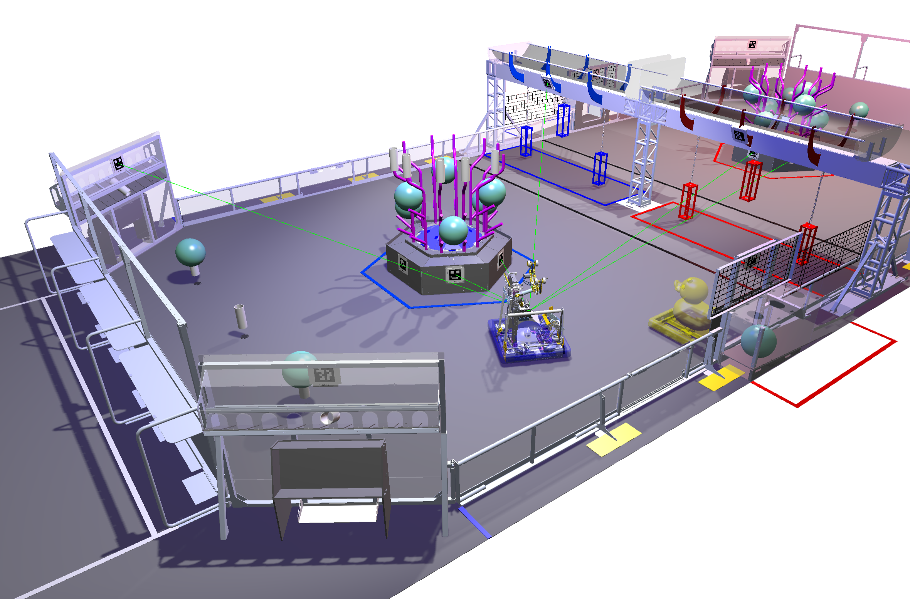

# Chronos Chain

*A command-driven framework where robotic actions unfold in flawless sequence, like links in a timeless chain.*

The architecture enforces strict interaction between subsystems solely through well-defined interfaces, ensuring complete abstraction from the underlying implementation—be it simulation or physical hardware. Each subsystem provides a minimal yet consistent API, from which atomic commands are derived to encapsulate discrete actions. These commands can then be composed into sequential operations, parallel executions, or conditional workflows, enabling flexible behavior orchestration. This modular command-based design facilitates the construction of the entire system as a hierarchical assembly of reusable, testable, and interchangeable components.

    

## Quick Start

See [Environment Setup](./docs/setup/)

## License

This code is licensed under the MIT License. It depends on WPILib and Advantage Kit, which are licensed under the BSD License.
