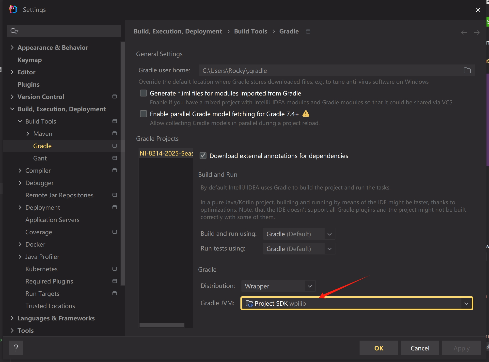

## Setup

### General

1. Clone
2. Run ``./gradlew`` to download gradle and needed vendordeps
3. Run ``./gradlew tasks`` to see available options

### Jetbrains Idea (optional)

- If you are using WPILib VS Code, ignore current section

1. Install [FRC](https://plugins.jetbrains.com/plugin/9405-frc) plugin through plugins market
2. Add WPILib bundled JDK manually
    
    
    

### Advantage Scope

1. Click `File -> Import Layout...` and import from `/ascope/layout.json`
2. Click `Help -> Show Assets Folder`, and copy `/ascope/Robot_**` to `**/AdvantageScope/userAssets/Robot_**`
3. In `Help -> Show Preferences (Ctrl+,)`
    - set `roboRIO Address` as `10.team.number.2`
    - set `roboRIO Log Folder` as `/home/lvuser/logs`
    - set `Live Source` as `NetworkTables 4`

### Elastic

- Click `File -> Download From Robot (Ctrl + D)`
- or click `File -> Open Layout (Ctrl + O)`, and manually select `src/main/deploy/elastic-layout.json`

## Quick Start

### Simulation

1. Run `Build & Run Simulate Java` in Idea
2. Run `Elastic` and toggle to `localhost (127.0.0.1)` in `Settings -> Network -> IP Address Mode`
3. Click `File -> Connect to Simulator (Ctrl+Shift+K)` in Advantage Scope and enjoy

### Replay

1. Select `Download Logs (Ctrl+D)` in Advantage Scope
    
2. Select and download the logs
3. Double click the log file
    
