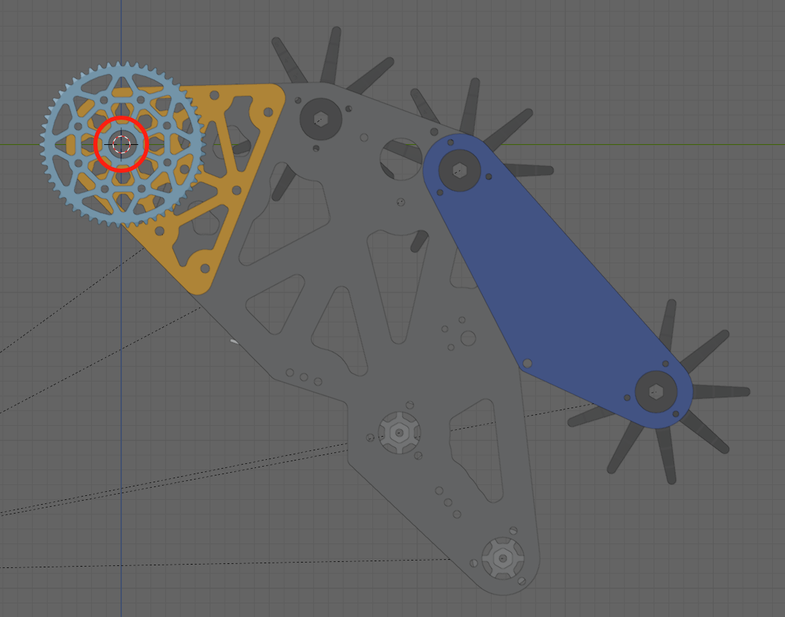
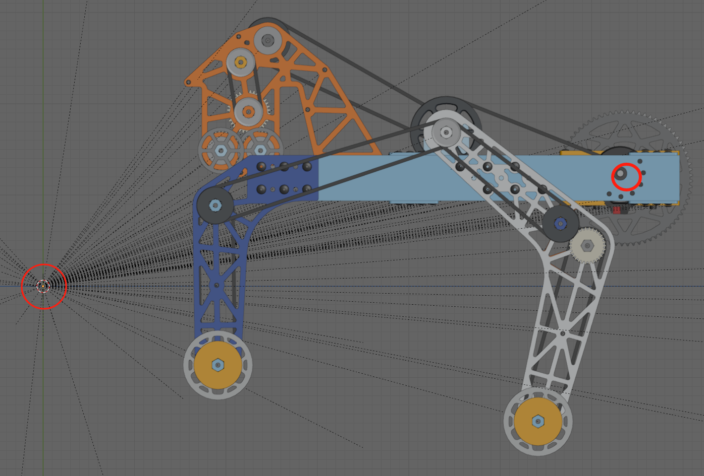

# AScope Assets

## GLB Assets

**The base glTF model should include no components**, then each component should be exported as a separate glTF model. Components models follow the naming convention "model_INDEX.glb", so the first articulated component would be "model_0.glb". For information about how to export glTF file from Onshape, Advantage Scope's doc already has a guide, [see](https://docs.advantagescope.org/more-features/gltf-convert).

> **Important Note:** Ensure the rotation center of each glTF model is positioned at the origin of the glTF coordinate system. Misaligned axes or incorrect rotation centers can lead to inaccurate visualizations and hinder diagnostics.
>
> **Align Case:**
> 
>
> **Misalign Case:**
> 

## Config File

`.\.ascope\Robot_*\config.json` is a file with format similar to:

```json
{
  "name": string // Unique name, required for all asset types
  "isFTC": string // Whether the model is intended for use on FTC fields instead of FRC fields (default "false")
  "disableSimplification": boolean // Whether to disable model simplification, optional
  "rotations": { "axis": "x" | "y" | "z", "degrees": number }[] // Sequence of rotations along the x, y, and z axes
  "position": [number, number, number] // Position offset in meters, applied after rotation
  "cameras": [ // Fixed camera positions, can be empty
    {
      "name": string // Camera name
      "rotations": { "axis": "x" | "y" | "z", "degrees": number }[] // Sequence of rotations along the x, y, and z axes
      "position": [number, number, number] // Position offset in meters relative to the robot, applied after rotation
      "resolution": [number, number] // Resolution in pixels, used to set the fixed aspect ratio
      "fov": number // Horizontal field of view in degrees
    }
  ],
  "components": [
    {
      "zeroedRotations": { "axis": "x" | "y" | "z", "degrees": number }[] // Sequence of rotations along the x, y, and z axes
      "zeroedPosition": [number, number, number] // Position offset in meters relative to the robot, applied after rotation
    }
  ]
}
```

The `components` array in the configuration file should match the number of models provided. For example, if you have 3 models (`model_0.glb`, `model_1.glb`, `model_2.glb`), the `components` array should include 3 entries:

```json
"components": [
  {
    "zeroedRotations": {},
    "zeroedPosition": [0, 0, 0]
  },
  {
    "zeroedRotations": {},
    "zeroedPosition": [0, 0, 0]
  },
  {
    "zeroedRotations": {},
    "zeroedPosition": [0, 0, 0]
  },
]
```

The values for `zeroedRotations` and `zeroedPosition` are not critical and can be set to zeros for simplicity.

## Structure

After completing the setup, your directory structure will look like this:

```plaintext
.ascope/
  ├── Robot_example/
  │   ├── config.json
  │   ├── model_0.glb
  │   ├── model_1.glb
  │   ├── model_2.glb
  │   └── model.glb (this is an empty glTF file)
  └── Robot_other/...
```

## Licence

[Advantage Scope](https://github.com/Mechanical-Advantage/AdvantageScope) is under a modified BSD-3 LICENSE.
