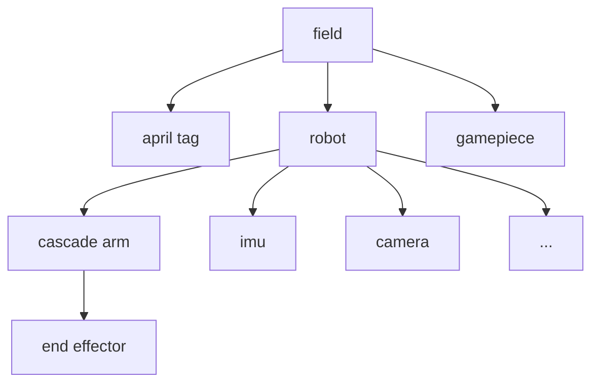
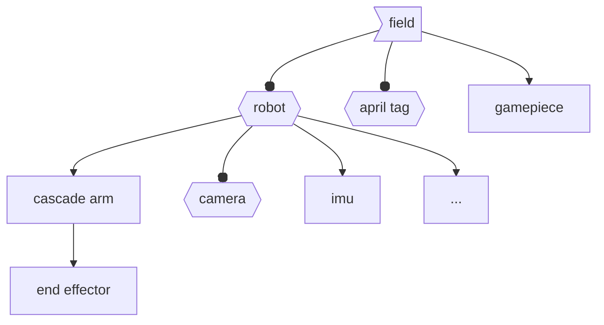

# Transformation Tree

## Example Usage

```java
final class RobotContainer {
  /**
   * VisualizerModelIndex contains constants representing indices of the corresponding 3D models
   * in the "model_idx.glb" file. These must match exactly the order defined in the model file.
   */
  private static final class VisualizerModelIndex {
    static final int DRIVETRAIN = 0;
    static final int ELEVATOR_L2 = 1;
    static final int ELEVATOR_L3 = 2;
    static final int CARRIAGE = 3;
    static final int ARM = 4;
    static final int INTAKE = 5;
    static final int ALGAE_ARM = 6;
    static final int CORAL_ARM = 7;
    static final int CORAL_INDEXER = 8;
    static final int CORAL_INTAKE = 9;
  }

  private final Visualizer visualizer;

  RobotContainer() {
    visualizer = new Visualizer();

    configureVisualizer();
    visualizer.print();
  }

  /**
   * Configures the visualizer by registering each component and its transformation logic.
   * Each call links a parent frame to a child frame using a specific model index and transform supplier.
   */
  private void configureVisualizer() {
    visualizer.registerVisualizedComponent(
        Visualizer.BASE_FRAME,
        "swerve",
        VisualizerModelIndex.DRIVETRAIN,
        swerve::getRobotToSwerveTransform);
    visualizer.registerVisualizedComponent(
        "swerve", "l2", VisualizerModelIndex.ELEVATOR_L2, arm::getDrivetrainToL2Transform);
    visualizer.registerVisualizedComponent(
        "l2", "l3", VisualizerModelIndex.ELEVATOR_L3, arm::getL2ToL3Transform);
    visualizer.registerVisualizedComponent(
        "l3", "l4", VisualizerModelIndex.CARRIAGE, arm::getL3ToL4Transform);
    visualizer.registerVisualizedComponent(
        "l4", "arm", VisualizerModelIndex.ARM, arm::getL4ToArmTransform);
    visualizer.registerVisualizedComponent(
        "arm",
        "algae_arm",
        VisualizerModelIndex.ALGAE_ARM,
        () ->
            GamePieceVisualizers.getAlgae().isEndEffectorStage()
                ? new Transform3d(.15, -.25, -.2, new Rotation3d())
                : new Transform3d(1e9, 1e9, 1e9, new Rotation3d()));
    visualizer.registerVisualizedComponent(
        "swerve",
        "coral_indexer",
        VisualizerModelIndex.CORAL_INDEXER,
        () ->
            rollerSensor.hasIndexerStaged()
                ? new Transform3d(.0, .22, .1, new Rotation3d(0, Math.PI / 2, 0))
                : new Transform3d(1e9, 1e9, 1e9, new Rotation3d()));
    visualizer.registerVisualizedComponent(
        "swerve",
        "coral_intake",
        VisualizerModelIndex.CORAL_INTAKE,
        () ->
            rollerSensor.hasGroundIntakeStaged()
                ? new Transform3d(.0, -.25, -.32, new Rotation3d(0, -Math.PI / 4, Math.PI / 2))
                : new Transform3d(1e9, 1e9, 1e9, new Rotation3d()));
  }
}
```

## Math Fundamentals


### Homogeneous Transformations

The fundamental mathematical object in a TF tree is the **rigid body transformation** between coordinate frames, represented as:

$$
{{}^bT_a}=\begin{bmatrix}{{}^bR_a}&{{}^bt_a}\\ 0&1\end{bmatrix}\in SE(3)
$$

meaning a transformation from frame $a$ to frame $b$. Where $SE(3)$ is the Special Euclidean group in 3D space, combining rotation and translation.

### Transformation Composition

A transformation $a\to c$ can composed by the transformation $a\to b$ and $b\to c$ throught multiplication:

$$
{{}^cT_a} = {{}^cT_b}\times{{}^bT_a}
$$

This property allows computing transforms between non-directly connected frames by chaining transformations along a path.

For any transformation ${{}^bT_a}$, we can find a unique inverse $({}^bT_a)^{-1}={{}^aT_b}$ satisfied:

$$
{{}^bT_a}{{}^aT_b}=I={{}^aT_b}{{}^bT_a}
$$

### Directed Acyclic Graph

A TF tree is a **directed acyclic graph** with a single root node representing global frame, child nodes representing local frames and edges representing relative transformations from parent to child. Typically, we select field coordinate as global frame for FRC:



### Transform Lookup Algorithm

To find ${{}^bT_a}$ between arbitrary frames $a$ and $b$, we need to find the **lowest common ancestor** denoted as $c$ of $a$ and $b$ in the tree first. Then compute the relative transformations ${{}^cT_a}=\prod_k^{a\to c}{{}^{k+1}T_k}$ and ${{}^cT_b}=\prod_k^{b\to c}{{}^{k+1}T_k}$. Finally,

$$
{{}^bT_a} = ({}^cT_b)^{-1} \times {{}^cT_a}
$$

For example, if we want to calculate the transformation from camera to april tag:



We first identify their **lowest common ancestor (LCA)** in the transform tree. Here, both frames descend from the **field** frame, making it the LCA. Next, we determine the transformation from the **field** to the **camera** by chaining the individual transforms along the path:

$$
{{}^\text{field}T_\text{cam}} = {{}^\text{field}T_\text{robot}} \times {{}^\text{robot}T_\text{cam}}
$$

Similarly, the transform from the **field** to the **april tag** is simply ${{}^\text{field}T_\text{tag}}$, since the april tag is a direct child of the field. Ultimately, we compute the desired transform by combining these two results:

$$
{{}^\text{cam}T_\text{tag}} = ({{}^\text{field}T_\text{cam}})^{-1} \times {{}^\text{field}T_\text{tag}}
$$

Expanding the inverse, this becomes:

$$
{{}^\text{cam}T_\text{tag}} = ({{}^\text{robot}T_\text{cam}})^{-1} \times ({{}^\text{field}T_\text{robot}})^{-1} \times {{}^\text{field}T_\text{tag}}
$$


## History API

### Version 25.1 - Visualizer


```java
final class RobotContainer {
  /**
   * VisualizerModelIndex contains constants representing indices of the corresponding 3D models
   * in the "model_idx.glb" file. These must match exactly the order defined in the model file.
   */
  private static final class VisualizerModelIndex {
    static final int DRIVETRAIN = 0;
    static final int ELEVATOR_L2 = 1;
    static final int ELEVATOR_L3 = 2;
    static final int CARRIAGE = 3;
    static final int ARM = 4;
    static final int INTAKE = 5;
    static final int ALGAE_ARM = 6;
    static final int CORAL_ARM = 7;
    static final int CORAL_INDEXER = 8;
    static final int CORAL_INTAKE = 9;
  }

  private final Visualizer visualizer;

  RobotContainer() {
    visualizer = new Visualizer();

    configureVisualizer();
    visualizer.print();
  }

  /**
   * Configures the visualizer by registering each component and its transformation logic.
   * Each call links a parent frame to a child frame using a specific model index and transform supplier.
   */
  private void configureVisualizer() {
    visualizer.registerVisualizedComponent(
        Visualizer.BASE_FRAME,
        "swerve",
        VisualizerModelIndex.DRIVETRAIN,
        swerve::getRobotToSwerveTransform);
    visualizer.registerVisualizedComponent(
        "swerve", "l2", VisualizerModelIndex.ELEVATOR_L2, arm::getDrivetrainToL2Transform);
    visualizer.registerVisualizedComponent(
        "l2", "l3", VisualizerModelIndex.ELEVATOR_L3, arm::getL2ToL3Transform);
    visualizer.registerVisualizedComponent(
        "l3", "l4", VisualizerModelIndex.CARRIAGE, arm::getL3ToL4Transform);
    visualizer.registerVisualizedComponent(
        "l4", "arm", VisualizerModelIndex.ARM, arm::getL4ToArmTransform);
    visualizer.registerVisualizedComponent(
        "arm",
        "algae_arm",
        VisualizerModelIndex.ALGAE_ARM,
        () ->
            GamePieceVisualizers.getAlgae().isEndEffectorStage()
                ? new Transform3d(.15, -.25, -.2, new Rotation3d())
                : new Transform3d(1e9, 1e9, 1e9, new Rotation3d()));
    visualizer.registerVisualizedComponent(
        "swerve",
        "coral_indexer",
        VisualizerModelIndex.CORAL_INDEXER,
        () ->
            rollerSensor.hasIndexerStaged()
                ? new Transform3d(.0, .22, .1, new Rotation3d(0, Math.PI / 2, 0))
                : new Transform3d(1e9, 1e9, 1e9, new Rotation3d()));
    visualizer.registerVisualizedComponent(
        "swerve",
        "coral_intake",
        VisualizerModelIndex.CORAL_INTAKE,
        () ->
            rollerSensor.hasGroundIntakeStaged()
                ? new Transform3d(.0, -.25, -.32, new Rotation3d(0, -Math.PI / 4, Math.PI / 2))
                : new Transform3d(1e9, 1e9, 1e9, new Rotation3d()));
  }
}
```

### Version 25.0 - AkitViz

1. Update Ids in `AkitViz.java`:
   ```java
   public AkitViz {
     public static final class Ids {
       public static final class ExampleSubsystem {
         public static final int EXAMPLE_COMPONENT_1 = 0;
         public static final int EXAMPLE_COMPONENT_2 = 1;
       }
     }
   }
   ```

2. Call `AkitViz.periodic()` periodically in `Robot.java`:
   ```java
   public class Robot {
     void robotPeriodic() {
       if(Config.MODE != Config.Mode.REAL) {
         AkitViz.getInstance().periodic();
       }
     }
   }
   ```

3. Define the zeroed transform matrix in `SubsystemConfig.java`:
   ```java
   public class SubsystemConfig {
     public static final Transform3d ZEROED_TF;
   }
   ```

4. Register a `record` object in the constructor of `Subsystem.java`:
   ```java
   public class Subsystem {
     public Subsystem() {
       AkitViz.getInstance().register(
         new AkitViz.AkitVizComponent(
           AkitViz.Ids.Subsystem.COMPONENT,
           AkitViz.Ids.Subsystem.PARENT_COMPONENT,
           () -> SubsystemConfig.ZEROED_TF.plus(this.deltaPose)  // or this.getDeltaPose()
         )
       );
     }
   }
   ```
